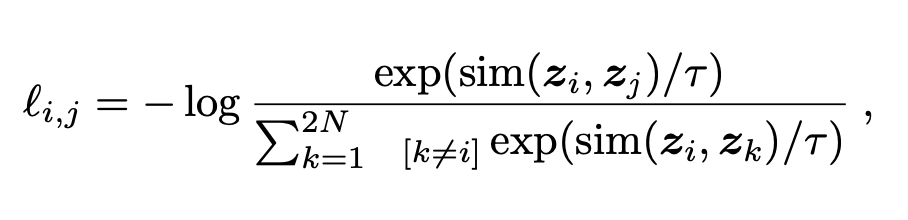
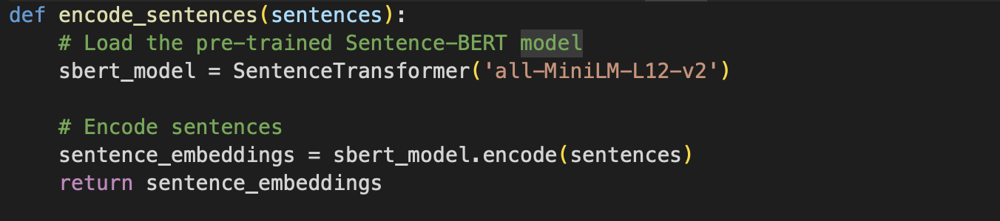

<html lang="en">
<head>
    <meta charset="UTF-8">
    <meta name="viewport" content="width=device-width, initial-scale=1.0">
    <title>AuthentiText: Paraphrase Detection using Siamese Neural Networks</title>
    
</head>

<body>

    

        <h1 style="color: #0047AB; font-size: 2.5em;">AuthentiText</h1>
        <h2 style="color: #0047AB; font-size: 1.8em;">Paraphrase Detection using Siamese Neural Networks</h2>
    

    

        <h2>Problem Statement</h2>
        
Accurately detecting paraphrased sentences amidst large amounts of text is a challenge. Paraphrased sentences convey the same meaning but use different wording, making traditional text-matching techniques ineffective. Sophisticated algorithms are needed to discern semantic similarity between sentences.

    

    

        <h2>Motivation</h2>
        
Plagiarism is a serious concern in academia, compromising the integrity of institutions and the value of scholarly work. Detecting paraphrased content can discourage plagiarism and promote academic honesty.

    

    

        <h2>Approach</h2>

        <h3>1. Data and Preprocessing</h3>
        
We initially used the MSR Paraphrase Dataset containing over 5,000 entries <a href="https://www.kaggle.com/datasets/doctri/microsoft-research-paraphrase-corpus?select=msr_paraphrase_train.txt">MSR dataset</a> 5800 pairs of sentences which have been extracted from news sources on the web, along with human annotations indicating whether each pair captures a paraphrase/semantic equivalence relationship.

        
Preprocessing in Natural Language Processing (NLP) is a crucial step to prepare raw text data for analysis and model training. The process typically begins with text normalization, which involves converting all characters to lowercase to ensure uniformity and removing any special characters, punctuation, or numbers that do not contribute to the semantic meaning. Next, tokenization is performed, where the text is split into individual words or tokens. Following this, stop word removal is applied to eliminate common words such as "and," "the," and "is," which usually do not carry significant meaning. Stemming and lemmatization are then used to reduce words to their root forms or base lemmas, ensuring that different forms of a word are treated as the same term. Part-of-speech tagging assigns grammatical tags to each word, aiding in understanding the syntactic structure.

        <h3>2. Word Embedding and Siamese Network</h3>
        
We employed Word2Vec for sentence embedding which is pivotal technique in natural language processing (NLP) for generating distributed representations of words in a continuous vector space. its objective is to embed words such that semantically similar words are close together in the vector space, enabling machines to grasp semantic relationships between words. Word2Vec operates through two models: Continuous Bag of Words (CBOW) and Skip-gram. CBOW predicts a target word from its surrounding context, whereas Skip-gram predicts surrounding words given a target word.

        

        
We have use a Siamese network for our model. A Siamese network is a neural architecture designed to determine the similarity or dissimilarity between two input samples, making it ideal for tasks like paraphrase detection. In the context of paraphrase identification, each branch of the Siamese network processes a different input sentence. The network employs identical neural network components for both branches, typically utilizing LSTM (Long Short-Term Memory) layers to capture sequential dependencies in sentences. During training, the network learns to embed sentences into fixed-dimensional vectors in such a way that similar sentences have vectors closer together in the embedding space, while dissimilar ones are farther apart. This process is guided by a contrastive loss function that penalizes the model when it incorrectly predicts the similarity between pairs.

        
        

        
The contrastive loss function was used for training this loss function computes a penalty based on the similarity or dissimilarity of pairs of examples, such as sentences in paraphrase detection or images in similarity tasks. For each pair, labeled as either similar or dissimilar, the loss function ensures that similar pairs have embeddings with small distances, typically measured by Euclidean distance or cosine similarity. Conversely, dissimilar pairs should have embeddings that exceed a specified margin to minimize the loss.

        
        

        
This model achieved an accuracy of 35%.

        
    

    

        <h3>3. Improvements for Better Accuracy</h3>
        
To improve accuracy, we made several changes:

        <ul>
            <li><strong>Dataset:</strong> We switched to the PAWS dataset available on Hugging Face <a href="https://huggingface.co/datasets/paws">PAWS dataset</a>. This dataset contains 108,463 human-labeled and 656k noisily labeled pairs that feature the importance of modeling structure, context, and word order information for the problem of paraphrase identification. The dataset has two subsets, one based on Wikipedia and the other one based on the Quora Question Pairs (QQP) dataset.</li>
            <li><strong>Embedding Technique:</strong> We replaced Word2Vec with Sentence BERT (specifically, the <code>paraphrase-multilingual-mpnet-base-v2</code> model) for word embedding. Sentence-BERT (SBERT) is an extension of the popular Word2Vec and BERT (Bidirectional Encoder Representations from Transformers) models, specifically designed for generating sentence embeddings. Unlike traditional word embeddings that capture meanings of individual words, SBERT focuses on capturing semantic meanings of entire sentences or phrases. This significantly improved accuracy to 55%.</li>
        </ul>
        
        
        

        
Experimenting with a different Sentence BERT model (<code>all-MiniLM-L12-v2</code>) yielded similar accuracy.

        
        

        
These adjustments demonstrate the importance of dataset and embedding techniques in Siamese Neural Network performance.

    

    

        <h2>Conclusion</h2>
        
We achieved an overall accuracy of 55% over four months. While this is a substantial improvement from the initial 35%, there's room for further enhancement.

                
Systematically refining our approach through datasets and embedding techniques highlights the importance of data quality and preprocessing methods in machine learning models. The shift from MSR Paraphrase Dataset to PAWS and from Word2Vec to Sentence BERT was crucial for improved accuracy.

        
Despite these advancements, the model's performance can be further optimized. Future work could explore:

        <ul>
            <li>More advanced neural network architectures</li>
            <li>Hyperparameter fine-tuning</li>
            <li>Integration of additional linguistic features</li>
        </ul>

        
Our experience underscores the iterative nature of machine learning projects, where continuous evaluation and adaptation are key to achieving optimal results.

        
Our GitHub repository link is <a href="https://github.com/ajiteshreddy24/AuthentiText">AuthentiText</a>.

    

    

        

        
Ajitesh Reddy, Venkata Ramana, Divyoth Reddy, Shivanth Reddy, Charith Reddy

    

</body>

</html>

